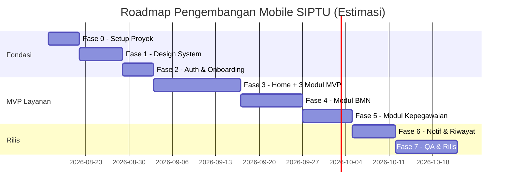

# 📱 PRD — Aplikasi Mobile SIPTU ULTRA (Flutter)

**Versi:** 1.0 (Draft)
**Tanggal:** 2026-08-12
**Status:** 🟡 Menunggu referensi desain UI/UX dari user

---

## 1. Ringkasan Eksekutif

Membangun aplikasi **mobile native (Flutter)** yang mentransfer seluruh fitur **Layanan Mandiri** dari aplikasi web SIPTU ULTRA (https://siptu.bpompalopo.com/app/layanan-mandiri) ke pengalaman mobile-first yang cepat, intuitif, dan premium.

**Fokus awal (MVP):** Melayani **permintaan/pengajuan layanan mandiri** — pegawai dapat mengajukan, melacak, dan mengelola layanan tata usaha langsung dari genggaman.

**Pendekatan:** Reuse backend API yang **sudah ada** (Laravel di `/core_api`), khususnya endpoint public (`/public/*`) yang sudah mendukung pengajuan tanpa auth + endpoint ber-auth untuk data pribadi. Tidak perlu membangun backend baru.

---

## 2. Tujuan & Prinsip

| # | Tujuan |
|---|---|
| T1 | Akses layanan tata usaha kapan saja, di mana saja via mobile |
| T2 | Alur pengajuan lebih cepat dari web (form ringkas, foto langsung, auto-save) |
| T3 | Status layanan real-time + notifikasi push |
| T4 | UI/UX premium sesuai referensi yang akan dikirim user |
| T5 | Offline-first: draft pengajuan tetap aman walau tanpa koneksi |

**Non-Goal (v1):**
- ✗ Admin/validator dashboard di mobile (tetap di web)
- ✗ SIPTU Drive / SIMKEU / SAKIP (layanan berat & eksternal — fase berikutnya)
- ✗ Manajemen data master

---

## 3. Persona & User Stories

### 👤 Persona: Pegawai Balai POM Palopo
- **NIP:** terdaftar di database karyawan
- **Kebutuhan:** mengajukan layanan, cek status, unduh dokumen
- **Level teknis:** beragam — desain harus sederhana & jelas

**User Stories (MVP):**
1. Sebagai pegawai, saya bisa login dengan NIP + password + MFA agar data saya aman.
2. Sebagai pegawai, saya bisa melihat semua layanan yang tersedia di satu layar (grid layanan).
3. Sebagai pegawai, saya bisa mengajukan **IT Helpdesk** dengan foto bukti kendala.
4. Sebagai pegawai, saya bisa mengajukan **Izin Keluar** dengan alasan & durasi.
5. Sebagai pegawai, saya bisa mengajukan **Peminjaman Arsip / BMN / Ruangan**.
6. Sebagai pegawai, saya bisa membuat **Pengajuan Surat Tugas** sederhana.
7. Sebagai pegawai, saya bisa melihat **riwayat & status** semua pengajuan saya.
8. Sebagai pegawai, saya mendapat **notifikasi** saat status pengajuan berubah.

---

## 4. Fitur Layanan Mandiri (Web → Mobile Mapping)

### 4.1 Inventaris Fitur Web (Sumber)

| ID | Layanan Web | Route Web | Kategori | Prioritas Mobile |
|---|---|---|---|---|
| S1 | IT Helpdesk | `/it-helpdesk/new` | IT | 🥇 **MVP Fase 3** |
| S2 | Izin Keluar (RISPEG) | `/izin-keluar` | Kepegawaian | 🥇 **MVP Fase 3** |
| S3 | Peminjaman Arsip | `/kearsipan-peminjaman/new` | Kepegawaian | 🥇 **MVP Fase 3** |
| S4 | Peminjaman BMN (SIMBA) | `/app/simba` | Logistik | 🥈 Fase 4 |
| S5 | Peminjaman Ruangan | `/peminjaman-ruangan` | Logistik | 🥈 Fase 4 |
| S6 | Permintaan Persediaan (SPB) | `/app/simba` | Logistik | 🥈 Fase 4 |
| S7 | Pengajuan Surat Tugas | `/app/surat-tugas` | Kepegawaian | 🥈 Fase 5 |
| S8 | Pengadaan PDTT | `/pengajuan-pdtt/new` | Logistik | 🥈 Fase 5 |
| S9 | Pengusulan PBJ | `/pengusulan-pengadaan/new` | Logistik | 🥉 Fase 6 |
| S10 | Pengajuan Zoom | `/app/zoom-generator` | Kepegawaian | 🥉 Fase 6 |
| S11 | Pengelolaan RHPK | `/app/rhpk` | Kepegawaian | 🥉 Fase 6 |
| S12 | Sesi Kompak (Pelatihan) | `/app/pelatihan-pegawai` | Kepegawaian | 🥉 Fase 6 |
| S13 | SIMKEU / SIPTU Drive / SAKIP | eksternal/berat | — | ⏳ Fase 7+ |

### 4.2 API Backend yang Tersedia (Reuse — Tanpa Backend Baru)

| Modul | Endpoint Public | Endpoint Auth |
|---|---|---|
| IT Helpdesk | `POST /public/it-helpdesk-tickets` | `GET /it-helpdesk-tickets` |
| | `GET /public/it-helpdesk-tickets/{id}/details` | |
| | `GET /public/it-helpdesk-tickets/{id}/pdf` | |
| Izin Keluar | `POST /public/exit-permits/lookup` | `GET /exit-permits` |
| | `POST /public/exit-permits/exit` | `GET /exit-permits/stats` |
| | `GET /public/exit-permits/{id}/details` | |
| | `PUT /public/exit-permits/{id}/return` | |
| Peminjaman Arsip | `POST /public/archive-loans` | `GET /archive-loans` |
| | `GET /public/archive-loans/{token}` | |
| Peminjaman BMN | `GET /public/bmn-assets` | `GET /bmn-loans` |
| | `POST /public/bmn-loans` | |
| | `GET /public/bmn-loans/{token}` | |
| Peminjaman Ruangan | `GET /public/room-loans/rooms` | |
| | `POST /public/room-loans` | |
| Permintaan Persediaan | `POST /public/inventory-requests` | `GET /inventory-requests` |
| Surat Tugas | `POST /public/surat-tugas` | `GET /surat-tugas/my-assignments` |
| | `GET /public/surat-tugas/mak-suggestions` | |
| Berita | `GET /news` | — |
| Aktivitas | — | `GET /dashboard/activities` |

---

## 5. 🗺️ Tahapan Pengembangan (Roadmap)

> User akan mengirimkan **referensi desain UI/UX** — design tokens disusun di Fase 1 setelah referensi diterima.

### 📍 Fase 0 — Fondasi & Persiapan Proyek *(bisa jalan sebelum desain)*
**Tujuan:** Proyek Flutter berdiri, lingkungan siap.
- [ ] Inisialisasi proyek Flutter di folder `mobile-flutter/`
- [ ] Struktur folder clean architecture (`lib/core`, `lib/features`, `lib/shared`)
- [ ] Setup `pubspec.yaml`: `dio`, `riverpod`, `go_router`, `flutter_secure_storage`, dll.
- [ ] Setup environment config (`--dart-define` untuk base URL API)
- [ ] CI/CD dasar (lint + test)
- **Deliverable:** Proyek kosong yang bisa `flutter run`

### 📍 Fase 1 — Design System & Theme *(setelah referensi desain diterima)*
**Tujuan:** Fondasi visual sesuai referensi user.
- [ ] ⏳ **Terima referensi desain UI/UX dari user**
- [ ] Definisikan design tokens: warna, tipografi, spacing, radius, elevation
- [ ] Implementasi theme Flutter (`ThemeData` light/dark)
- [ ] Komponen reusable: buttons, inputs, cards, chips, modals/bottom-sheets, status pills
- [ ] Ikon & ilustrasi aplikasi (logo SIPTU, splash screen)
- **Deliverable:** Design system Flutter + style guide internal

### 📍 Fase 2 — Autentikasi & Onboarding
**Tujuan:** Login aman dengan data terintegrasi.
- [ ] API client (Dio) + interceptor token (Bearer)
- [ ] Login NIP + password (+ **MFA TOTP** — sudah ada di backend `POST /mfa/verify`)
- [ ] Secure storage token (`flutter_secure_storage`)
- [ ] Auto-login / refresh session
- [ ] Halaman profil pegawai (foto, NIP, jabatan, KGB)
- [ ] Deep link & handling 401 global
- **Deliverable:** User bisa login, sesi aman, profil tampil

### 📍 Fase 3 — Home Layanan Mandiri + Modul MVP (IT Helpdesk, Izin Keluar, Arsip)
**Tujuan:** ⭐ **Fokus utama user — melayani permintaan layanan mandiri**
- [ ] Home: greeting, slider berita, grid layanan (searchable)
- [ ] **Modul IT Helpdesk**: form kendala + upload foto → submit → track status + unduh PDF
- [ ] **Modul Izin Keluar**: form alasan/durasi → submit → detail + tombol kembali
- [ ] **Modul Peminjaman Arsip**: cari arsip → ajukan → detail + unduh PDF
- [ ] Riwayat layanan terpadu (tab status: proses, selesai, ditolak)
- **Deliverable:** 3 modul MVP end-to-end bekerja

### 📍 Fase 4 — Modul BMN (Peminjaman Aset, Ruangan, Persediaan)
- [ ] **Peminjaman BMN**: pilih aset (daftar tersedia) → tanggal → submit → tracking
- [ ] **Peminjaman Ruangan**: lihat jadwal → pilih slot → submit
- [ ] **Permintaan Persediaan (SPB)**: pilih item + jumlah → submit
- **Deliverable:** 3 modul logistik berfungsi

### 📍 Fase 5 — Modul Kepegawaian (Surat Tugas, PDTT)
- [ ] **Pengajuan Surat Tugas**: tanggal + lokasi + deskripsi (+ MAK suggestions) → draft → status
- [ ] **Pengadaan PDTT**: pilih item dari daftar periode aktif → ajukan
- **Deliverable:** Modul kepegawaian berfungsi

### 📍 Fase 6 — Notifikasi Push & Fitur Pendukung
- [ ] Notifikasi push (FCM / OneSignal) untuk perubahan status
- [ ] Riwayat layanan lengkap + filter + detail offline cache
- [ ] Modul sisa (Zoom, RHPK, Sesi Kompak) sesuai prioritas
- [ ] Unduh dokumen (PDF SPA/tiket) via share sheet
- **Deliverable:** Aplikasi hampir lengkap, notifikasi aktif

### 📍 Fase 7 — QA, Polishing, & Rilis
- [ ] Test end-to-end semua alur pengajuan
- [ ] Performance pass (cold start, image caching, list virtualisasi)
- [ ] Accessibility (font scale, contrast)
- [ ] Beta internal (TestFlight / internal testing Play Console)
- [ ] Publikasi Play Store (signed APK/AAB)
- **Deliverable:** v1.0 di Play Store



---

## 6. Arsitektur Teknis (Usulan)

### Stack
| Layer | Teknologi |
|---|---|
| Framework | Flutter (Dart 3.x, Material 3) |
| State | Riverpod (auto-dispose) |
| Routing | go_router (deep links) |
| Network | dio + interceptors + retry |
| Storage | flutter_secure_storage (token), hive/isar (cache) |
| Notifikasi | FCM (fase 6) |
| Backend | Reuse Laravel API `https://siptu.bpompalopo.com/core_api/api` |

### Struktur Folder (usulan)
```
mobile-flutter/
├── lib/
│   ├── main.dart
│   ├── core/
│   │   ├── api/          # dio client, interceptors, endpoints
│   │   ├── theme/        # design tokens, ThemeData
│   │   ├── router/       # go_router config
│   │   ├── storage/      # secure storage, cache
│   │   └── utils/
│   ├── features/
│   │   ├── auth/         # login, mfa, profile
│   │   ├── home/         # dashboard layanan
│   │   ├── it_helpdesk/
│   │   ├── exit_permit/
│   │   ├── archive_loan/
│   │   ├── bmn_loan/
│   │   ├── room_loan/
│   │   ├── surat_tugas/
│   │   ├── pdtt/
│   │   └── history/      # riwayat terpadu
│   └── shared/           # widgets reusable
```

---

## 7. Keamanan

- Token disimpan di `flutter_secure_storage` (Keychain/Keystore)
- Sertifikat SSL pinning opsional (dio bad-certificate-handle)
- MFA TOTP wajib untuk aksi sensitif (sesuai kebijakan web)
- Logout otomatis saat 401 / sesi kedaluwarsa
- No hardcoded secret di kode — semua via `--dart-define`

---

## 8. Kriteria Sukses (Definition of Done per Fase)

- ✅ Semua user story fase tersebut berfungsi end-to-end (API nyata)
- ✅ Desain konsisten dengan design system fase 1
- ✅ Tidak ada crash pada perangkat uji (min. Android 8+)
- ✅ Build release (`flutter build apk --release`) berhasil tanpa error
- ✅ Data pengajuan tersimpan di backend (terverifikasi di web admin)

---

## 9. ⚠️ Open Questions

> [!IMPORTANT]
> **Q1 — Referensi Desain:** Kapan referensi UI/UX dikirim? (menentukan mulai Fase 1). Format: gambar/figma/PDF?

> [!IMPORTANT]
> **Q2 — Target Platform v1:** Android saja, atau Android + iOS? (mempengaruhi setup & testing)

> [!IMPORTANT]
> **Q3 — Scope MVP:** Konfirmasi 3 modul MVP fase 3 (IT Helpdesk, Izin Keluar, Peminjaman Arsip) — atau ada modul lain yang lebih prioritas?

> [!NOTE]
> **Q4 — Nama & Identitas Aplikasi:** Nama tampilan di Play Store ("SIPTU Mobile"?), ikon & splash menggunakan logo BPOM yang ada?

> [!NOTE]
> **Q5 — Lokasi Folder:** Proyek Flutter diletakkan di `mobile-flutter/` (baru) atau menggantikan `mobile-rn/` yang kosong?

---

## 10. Lampiran: Daftar Endpoint yang Relevan (Referensi Teknis)

Lihat [routes/api.php](file:///f:/sites/SUPERAPP/SIPTUULTRA/backend/routes/api.php) — bagian `throttle:public-api` (baris 113+) untuk endpoint public yang akan dikonsumsi aplikasi mobile.
