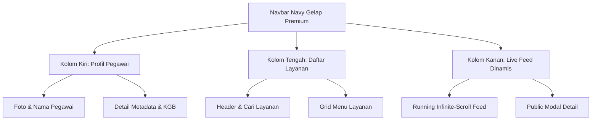

# Rencana Implementasi Redesain Layanan Mandiri (UI/UX Premium SIASN Style)

Dokumen ini berisi rencana rinci pembaruan antarmuka (UI/UX) pada halaman utama **Layanan Mandiri** (`/app/layanan-mandiri`). Pembaruan ini bertujuan untuk merombak tata letak halaman lama menjadi tata letak modern **3-Kolom** dengan gaya premium berstandar portal **SIASN**, yang memadukan estetika profesional, navigasi presisi, dan kinerja responsif tinggi.

---

## 💎 Konsep Desain & Estetika Premium

1. **Skema Warna Premium**:
   - Menggunakan warna **Navy Blue Gelap** (`#0b1329` hingga `#1e293b`) sebagai warna dasar Navbar untuk memberikan kesan berwibawa, elegan, dan kokoh seperti aplikasi portal instansi pemerintah modern (SIASN).
   - Memadukan elemen **glassmorphic** (kombinasi warna putih semi-transparan, blur latar belakang tinggi, dan border halus dengan glow tipis) untuk panel visual utama.
   - Pertahankan warna **Slate & Indigo** dari Design System baru pada konten tengah untuk menjaga harmoni global aplikasi.

2. **Tipografi & Micro-Interaction**:
   - Menghormati pengaturan font global: **Plus Jakarta Sans** untuk Heading & Title, dan **Inter** untuk Body & Data-text.
   - Transisi halus (Smooth transition `0.3s ease`) pada efek hover tombol, kartu layanan, dan profil pill.
   - Menggunakan ikon modern berkualitas tinggi dari `@ant-design/icons` dengan warna harmonis.

---

## 🛠️ Ringkasan Rencana Perubahan



### 1. ─── Navbar Navy Gelap Premium ───
- **Perubahan Warna & Gaya**: Diubah dari latar belakang putih/light transparan menjadi Navy Gelap Solid / Semi-Transparan dengan blur (`background: rgba(11, 19, 41, 0.95); backdrop-filter: blur(16px);`).
- **Logo Ganda**: Menampilkan logo **SIPTU** berdampingan dengan logo **BPOM** (menggunakan `/logo/logo.png` atau logo teks terpadu secara elegan).
- **Logika Nama Pegawai**: Nama pegawai di pojok kanan atas dipotong menggunakan string split sehingga hanya menampilkan **1 kata pertama** saja (`user?.name?.split(" ")[0] || "Pegawai"`).
- **Waktu Digital & APK Link**: Menampilkan waktu digital real-time, link unduh APK Android dengan ikon khusus, dan link navigasi utama (Beranda, Riwayat, Website Balai).

### 2. ─── Layout Utama 3-Kolom (Desktop) ───
Kita akan mengubah pembungkus utama halaman (`.lm-page`) menggunakan CSS Grid:
```css
.lm-main-container {
  display: grid;
  grid-template-columns: 320px 1fr 360px;
  gap: 24px;
  max-width: 1440px;
  margin: 24px auto;
  padding: 0 24px;
  align-items: start;
}
```
*Catatan: Pada tampilan mobile (lebar layar < 1024px), layout akan otomatis turun menjadi 1 kolom bertumpuk secara vertikal (Responsive Flex direction).*

---

## 📂 Rincian Komponen 3-Kolom

### 👈 Kolom Kiri: Profil Pegawai & Informasi Metadata
Merupakan kartu profil pegawai statis yang menampilkan informasi lengkap dan akurat mengenai jabatan dan kenaikan gaji berkala (KGB).
- **Bagian Atas**:
  - Foto profil melingkar (`.profile-avatar-circle`) dengan inisial huruf kapital besar bergradien premium dengan border glow tipis.
  - Nama panggilan pegawai (1 kata pertama) dengan font besar tebal (`Plus Jakarta Sans`).
  - Badge NIP (`user?.nip` atau data fallback) dengan latar belakang warna gelap kontras.
  - Deskripsi Jabatan / Area Fungsi (`user?.function_area` atau `"Pegawai Balai POM"`).
- **Bagian Metadata (Informasi Detail)**:
  - Disusun secara vertikal dengan ikon modern, judul label kecil, dan isi nilai tebal.
  - **KGB Terakhir**: Tanggal/Keterangan KGB sebelumnya (mengambil dari `user?.kgb_terakhir` atau data fallback tanggal statis/dinamis yang dihitung).
  - **KGB Akan Datang (Terencana)**: Estimasi tanggal KGB mendatang (2 tahun sejak KGB Terakhir, atau mengambil dari `user?.kgb_akan_datang`).
  - **Email**: Alamat email resmi pegawai (`user?.email || "-"`).
  - **No HP**: Nomor handphone aktif (`user?.phone || user?.no_hp || "-"`).

### 🏛️ Kolom Tengah: Daftar Layanan Mandiri
Merupakan pusat akses utama dari seluruh layanan tata usaha Balai POM di Palopo.
- **Header**: **"Daftar Layanan"** dengan ukuran font `H1` (26px), tebal, dan memiliki garis dekorasi tipis di bawahnya yang elegan.
- **Pencarian & Kategori**:
  - Kolom input pencarian (`SearchOutlined`) ditempatkan tepat di bawah header untuk pemfilteran cepat.
  - Kategori menu berbentuk pill (Semua, Logistik, Kepegawaian, IT Helpdesk) yang responsif dan interaktif.
- **Grid Menu Layanan**:
  - Menampilkan menu-menu layanan aktif seperti Peminjaman Arsip, Peminjaman BMN, Peminjaman Ruangan, Izin Keluar, IT Helpdesk, SAKIP, dan Pengusulan PBJ.
  - Kartu layanan didesain mewah dengan border melengkung besar, bayangan lembut, dan efek translasi ke atas (`translateY(-6px)`) saat disorot (hover).

### 👉 Kolom Kanan: Running Live Feed (Aktivitas Real-Time)
Menampilkan daftar log aktivitas publik dari seluruh sistem SIPTU & SELARAS secara live.
- **Tinggi Presisi**: Tinggi wadah diatur dinamis presisi di layar menggunakan formula CSS (`height: calc(100vh - 140px);`) dan bersifat lengket (`position: sticky; top: 90px;`).
- **Autoscroll Dinamis (1 Baris/Column Vertical Run)**:
  - Menggunakan teknik kombinasi animasi CSS `@keyframes scrollVertical` atau script interval JavaScript untuk menggeser feed ke atas secara berkelanjutan tanpa putus (infinite looping).
  - Jika diarahkan kursor (hover), scroll otomatis akan **berhenti sejenak (pause)** agar pengguna dapat membaca atau mengklik data aktivitas dengan nyaman.
- **Modul Interaktif**:
  - Setiap kartu feed bertipe `bmn`, `it_helpdesk`, dan `izin_keluar` tetap dapat diklik untuk membuka modal rincian (Popup Modal) bawaan yang sudah diatur dengan tipografi Slate & Indigo.

---

## 📝 Contoh Perubahan Kode (Draft Teknis)

### 🧩 Perubahan JSX pada `LayananMandiri.jsx`

#### 1. Logika Nama Pegawai (1 Kata Pertama)
```javascript
const userName = useMemo(() => {
  if (!user?.name) return "Pegawai";
  return user.name.trim().split(" ")[0];
}, [user]);
```

#### 2. Informasi KGB & Fallback Metadata
```javascript
// Melakukan kalkulasi tanggal jika tidak disediakan di database
const kgbTerakhir = user?.kgb_terakhir || user?.kgb_last || "01 Januari 2025";
const kgbAkanDatang = user?.kgb_akan_datang || user?.kgb_next || "01 Januari 2027";
```

#### 3. Struktur Layout Grid 3-Kolom Baru
```jsx
return (
  <div className="lm-page">
    {/* Ambient Blur */}
    <div className="lm-ambient">
      <div className="lm-ambient-orb lm-orb-1" />
      <div className="lm-ambient-orb lm-orb-2" />
    </div>

    {/* Navbar Navy Gelap Premium */}
    <nav className="lm-nav lm-nav-navy">
      <div className="lm-nav-inner">
        <div className="lm-brand-container">
          <div className="lm-logo-box">
            
          </div>
          <div className="lm-brand-text">
            <h1 className="nav-title-navy">SIPTU</h1>
            <span className="nav-sub-navy">Balai POM Palopo</span>
          </div>
        </div>

        <div className="lm-nav-center">
          <a className="lm-nav-link-navy active" onClick={() => navigate("/app/layanan-mandiri")}>Beranda</a>
          <a className="lm-nav-link-navy" onClick={() => navigate("/app/riwayat-layanan")}>Riwayat</a>
          <a className="lm-nav-link-navy" onClick={() => window.open('https://palopo.pom.go.id', '_blank')}>Website Balai</a>
        </div>

        <div className="lm-nav-right">
          <div className="lm-nav-time-box time-box-navy">
            <span className="lm-time-text text-white">{currentTime.toLocaleTimeString("id-ID", { hour: "2-digit", minute: "2-digit" })}</span>
            <span className="lm-date-text text-gray">{currentTime.toLocaleDateString("id-ID", { weekday: "short", day: "numeric", month: "short" })}</span>
          </div>

          <button className="lm-icon-btn btn-navy" onClick={() => window.open('https://www.dropbox.com/scl/fi/jwli2flrz0lv59f3qsddp/update.apk?rlkey=qd9pbowzjr67cp1wdoc9wlqb5&st=kq1wwagm&dl=1', '_blank')} title="Download App">
            <AndroidOutlined />
          </button>

          {canAccessDashboard && (
            <button className="lm-icon-btn btn-navy" onClick={() => navigate(dashboardPath)} title="Dashboard">
              <DashboardOutlined />
            </button>
          )}

          <div className="lm-profile-pill profile-pill-navy" onClick={() => setShowUserMenu(!showUserMenu)}>
            <div className="lm-avatar">{(user?.name?.[0] || "U").toUpperCase()}</div>
            <div className="lm-profile-info">
              <span className="lm-profile-name text-white">{userName}</span>
              <span className="lm-profile-role text-blue">{currentRole || "Pegawai"}</span>
            </div>
          </div>
          
          {showUserMenu && (
            <>
              <div className="lm-user-menu-backdrop" onClick={() => setShowUserMenu(false)} />
              <div className="lm-user-menu user-menu-navy">
                <button onClick={() => { setShowUserMenu(false); navigate("/app/account-settings"); }}><SettingOutlined /> Pengaturan Akun</button>
                <button onClick={() => { setShowUserMenu(false); navigate("/app/riwayat-layanan"); }}><HistoryOutlined /> Riwayat Layanan</button>
                <div className="lm-user-menu-divider" />
                <button className="lm-user-menu-danger" onClick={() => { setShowUserMenu(false); logout(); }}><LogoutOutlined /> Keluar</button>
              </div>
            </>
          )}
        </div>
      </div>
    </nav>

    {/* Pembungkus Layout 3-Kolom */}
    <div className="lm-main-container">
      
      {/* 👈 KOLOM KIRI: Profil & Informasi Metadata */}
      <aside className="lm-left-col">
        <div className="lm-profile-card-siasn">
          <div className="profile-card-header">
            <div className="profile-avatar-circle-glow">
              <span className="avatar-letter">{(user?.name?.[0] || "U").toUpperCase()}</span>
            </div>
            <h2 className="profile-employee-name">{userName}</h2>
            <span className="profile-nip-badge">NIP. {user?.nip || "19940212XXXXXXXXXX"}</span>
            <p className="profile-employee-jabatan">{user?.function_area || "Jabatan Fungsional"}</p>
          </div>
          
          <div className="profile-card-divider" />
          
          <div className="profile-metadata-list">
            <div className="metadata-item">
              <span className="metadata-icon">📅</span>
              <div className="metadata-details">
                <span className="metadata-label">KGB Terakhir</span>
                <span className="metadata-value">{kgbTerakhir}</span>
              </div>
            </div>
            
            <div className="metadata-item">
              <span className="metadata-icon">🚀</span>
              <div className="metadata-details">
                <span className="metadata-label">KGB Mendatang</span>
                <span className="metadata-value">{kgbAkanDatang}</span>
              </div>
            </div>
            
            <div className="metadata-item">
              <span className="metadata-icon">✉️</span>
              <div className="metadata-details">
                <span className="metadata-label">Email</span>
                <span className="metadata-value truncate-text" title={user?.email}>{user?.email || "-"}</span>
              </div>
            </div>
            
            <div className="metadata-item">
              <span className="metadata-icon">📞</span>
              <div className="metadata-details">
                <span className="metadata-label">No. HP / Telepon</span>
                <span className="metadata-value">{user?.phone || user?.no_hp || "-"}</span>
              </div>
            </div>
          </div>
        </div>
      </aside>

      {/* 🏛️ KOLOM TENGAH: Layanan Utama */}
      <main className="lm-center-col">
        <div className="lm-services-header-box">
          <h2 className="lm-services-section-title">Daftar Layanan</h2>
          <p className="lm-services-section-subtitle">Pilih kategori di bawah ini atau gunakan pencarian untuk menemukan layanan yang Anda butuhkan.</p>
          
          {/* Input Pencarian */}
          <div className="lm-search-container-center">
            <SearchOutlined className="search-icon-inside" />
            <input 
              type="text" 
              placeholder="Cari layanan administrasi..." 
              value={searchTerm} 
              onChange={(e) => setSearchTerm(e.target.value)} 
              className="search-input-premium"
            />
          </div>
        </div>

        {/* Filter Kategori */}
        <div className="lm-category-pills-center">
          {CATEGORIES.map((cat) => (
            <button
              key={cat.key}
              className={`lm-pill-premium ${selectedCategory === cat.key ? "active" : ""}`}
              onClick={() => setSelectedCategory(cat.key)}
            >
              <span className="lm-pill-emoji">{cat.emoji}</span>
              <span>{cat.label}</span>
            </button>
          ))}
        </div>

        {/* Grid Menu Layanan */}
        <div className="lm-services-grid-premium">
          {filteredServices.map((service, index) => (
            <div
              key={service.id}
              className="lm-card-premium"
              onClick={() => {
                if (service.link.startsWith("http")) {
                  window.open(service.link, "_blank");
                } else {
                  navigate(service.link);
                }
              }}
              style={{ "--card-accent": service.accent }}
            >
              <div className="lm-card-icon-container">
                 {
                    e.target.style.display = 'none';
                    e.target.nextSibling.style.display = 'flex';
                  }}
                  className="lm-card-image" 
                />
                <div className="lm-card-emoji-fallback">{service.emoji}</div>
              </div>
              <h3 className="lm-card-title-premium">{service.title}</h3>
              <p className="lm-card-desc-premium">{service.description}</p>
            </div>
          ))}
        </div>

        {filteredServices.length === 0 && (
          <div className="lm-empty-premium">
            <div className="lm-empty-icon-premium">🔍</div>
            <h3>Layanan Tidak Ditemukan</h3>
            <p>Silakan coba cari dengan kata kunci yang berbeda.</p>
          </div>
        )}
      </main>

      {/* 👉 KOLOM KANAN: Live Feed Dinamis dengan Infinite Scroll */}
      <aside className="lm-right-col">
        <div className="lm-live-feed-card">
          <div className="feed-header-navy">
            <span className="feed-dot-blink-navy" />
            <h3 className="feed-title-navy">LIVE FEED AKTIVITAS</h3>
          </div>
          
          <div className="feed-scroll-container">
            <div className="feed-scroll-track">
              {recentActivities.length > 0 ? (
                // Lakukan duplikasi array agar efek looping tanpa batas berjalan mulus
                [...recentActivities, ...recentActivities].map((activity, idx) => (
                  <div 
                    key={`${activity.id || idx}-${idx}`} 
                    className="feed-item-card-premium clickable"
                    onClick={() => handleActivityClick(activity)}
                  >
                    <div className={`feed-item-icon-circle ${activity.type}`}>
                      {activity.type === 'selaras' ? <CloudUploadOutlined /> :
                        activity.type === 'bmn' ? <FundOutlined /> :
                        activity.type === 'ruangan' ? <BankOutlined /> :
                        activity.type === 'izin_keluar' ? <LogoutOutlined /> :
                        activity.type === 'it_helpdesk' ? <ToolOutlined /> :
                        activity.type === 'surat_tugas' ? <FileProtectOutlined /> :
                        <AppstoreOutlined />}
                    </div>
                    <div className="feed-item-body-premium">
                      <div className="feed-item-meta-premium">
                        <span className={`feed-item-badge ${activity.type}`}>
                          {activity.type === 'izin_keluar' ? 'Izin Keluar' : activity.type.toUpperCase().replace('_', ' ')}
                        </span>
                        <span className="feed-item-time">{dayjs(activity.date).fromNow()}</span>
                      </div>
                      <h4 className="feed-item-title-premium">{activity.title}</h4>
                      <p className="feed-item-desc-premium">{activity.description}</p>
                    </div>
                  </div>
                ))
              ) : (
                <div className="feed-empty-state-navy">
                  <HistoryOutlined className="empty-icon-spin" />
                  <p>Menunggu aktivitas terbaru...</p>
                </div>
              )}
            </div>
          </div>
        </div>
      </aside>

    </div>

    {/* Modals & Floating Assistant */}
    {/* ... Tetap Dipertahankan Sempurna ... */}
    <AIAssistantWidget />
  </div>
);
```

---

## 🎨 Perubahan CSS pada `LayananMandiri.css`

Kita akan mengganti dan menambahkan aturan styling untuk tata letak 3-Kolom dan Navigasi Navy Gelap di `LayananMandiri.css`:

```css
/* ─── Premium Navy Navbar ─── */
.lm-nav.lm-nav-navy {
  background: rgba(15, 23, 42, 0.96) !important;
  border-bottom: 1px solid rgba(255, 255, 255, 0.08);
  box-shadow: 0 4px 30px rgba(0, 0, 0, 0.15);
  backdrop-filter: blur(16px);
  -webkit-backdrop-filter: blur(16px);
}

.nav-title-navy {
  color: #ffffff !important;
  font-family: var(--ff-heading);
  font-weight: 700;
}

.nav-sub-navy {
  color: #94a3b8 !important;
  font-size: 10px;
  font-weight: 600;
  letter-spacing: 1px;
}

.lm-nav-link-navy {
  color: #94a3b8 !important;
  font-weight: 600;
  font-size: 14px;
  cursor: pointer;
  transition: all 0.3s;
  text-decoration: none;
}

.lm-nav-link-navy:hover, .lm-nav-link-navy.active {
  color: #3b82f6 !important;
  text-shadow: 0 0 10px rgba(59, 130, 246, 0.4);
}

.btn-navy {
  background: rgba(255, 255, 255, 0.05) !important;
  border: 1px solid rgba(255, 255, 255, 0.1) !important;
  color: #cbd5e1 !important;
}

.btn-navy:hover {
  background: #3b82f6 !important;
  border-color: #3b82f6 !important;
  color: white !important;
}

.profile-pill-navy {
  background: rgba(255, 255, 255, 0.05) !important;
  border: 1px solid rgba(255, 255, 255, 0.1) !important;
}

.profile-pill-navy:hover {
  border-color: #3b82f6 !important;
  box-shadow: 0 0 12px rgba(59, 130, 246, 0.3);
}

.user-menu-navy {
  background: #0f172a !important;
  border: 1px solid rgba(255, 255, 255, 0.1) !important;
  box-shadow: 0 20px 40px rgba(0, 0, 0, 0.3) !important;
}

.user-menu-navy button {
  color: #e2e8f0 !important;
}

.user-menu-navy button:hover {
  background: rgba(255, 255, 255, 0.05) !important;
}

/* ─── Layout 3-Kolom Utama ─── */
.lm-main-container {
  display: grid;
  grid-template-columns: 320px 1fr 360px;
  gap: 24px;
  max-width: 1440px;
  margin: 24px auto;
  padding: 0 24px;
  align-items: start;
  position: relative;
  z-index: 10;
}

/* ─── Kolom Kiri: Profil SIASN ─── */
.lm-left-col {
  position: sticky;
  top: 90px;
}

.lm-profile-card-siasn {
  background: rgba(255, 255, 255, 0.85);
  backdrop-filter: blur(20px);
  border: 1px solid rgba(255, 255, 255, 0.5);
  border-radius: 24px;
  padding: 24px;
  box-shadow: 0 10px 30px rgba(0, 0, 0, 0.03);
}

.profile-card-header {
  display: flex;
  flex-direction: column;
  align-items: center;
  text-align: center;
}

.profile-avatar-circle-glow {
  width: 90px;
  height: 90px;
  border-radius: 50%;
  background: linear-gradient(135deg, #1e3a8a, #3b82f6);
  display: flex;
  align-items: center;
  justify-content: center;
  box-shadow: 0 0 20px rgba(59, 130, 246, 0.3);
  border: 3px solid #ffffff;
  margin-bottom: 16px;
}

.avatar-letter {
  font-size: 32px;
  font-weight: 700;
  color: white;
  font-family: var(--ff-heading);
}

.profile-employee-name {
  font-family: var(--ff-heading);
  font-size: 20px;
  font-weight: 700;
  color: #0f172a;
  margin: 0 0 8px 0;
}

.profile-nip-badge {
  font-family: monospace;
  font-size: 12px;
  background: #f1f5f9;
  color: #475569;
  padding: 4px 12px;
  border-radius: 100px;
  font-weight: 600;
  margin-bottom: 8px;
}

.profile-employee-jabatan {
  font-size: 13px;
  color: #64748b;
  margin: 0;
  line-height: 1.4;
}

.profile-card-divider {
  height: 1px;
  background: #e2e8f0;
  margin: 20px 0;
}

.profile-metadata-list {
  display: flex;
  flex-direction: column;
  gap: 16px;
}

.metadata-item {
  display: flex;
  align-items: flex-start;
  gap: 14px;
}

.metadata-icon {
  font-size: 18px;
  margin-top: 2px;
}

.metadata-details {
  display: flex;
  flex-direction: column;
}

.metadata-label {
  font-size: 11px;
  color: #94a3b8;
  font-weight: 600;
  text-transform: uppercase;
  letter-spacing: 0.5px;
}

.metadata-value {
  font-size: 13px;
  color: #334155;
  font-weight: 700;
  margin-top: 1px;
}

.truncate-text {
  max-width: 200px;
  white-space: nowrap;
  overflow: hidden;
  text-overflow: ellipsis;
}

/* ─── Kolom Tengah: Layanan Premium ─── */
.lm-center-col {
  background: rgba(255, 255, 255, 0.7);
  backdrop-filter: blur(20px);
  border: 1px solid rgba(255, 255, 255, 0.4);
  border-radius: 24px;
  padding: 32px;
  box-shadow: 0 10px 30px rgba(0, 0, 0, 0.02);
}

.lm-services-header-box {
  margin-bottom: 24px;
}

.lm-services-section-title {
  font-family: var(--ff-heading);
  font-size: 26px;
  font-weight: 700;
  color: #0f172a;
  margin: 0 0 8px 0;
}

.lm-services-section-subtitle {
  font-size: 14px;
  color: #64748b;
  margin: 0 0 20px 0;
  line-height: 1.5;
}

.lm-search-container-center {
  position: relative;
  width: 100%;
}

.search-icon-inside {
  position: absolute;
  left: 18px;
  top: 50%;
  transform: translateY(-50%);
  color: #94a3b8;
  font-size: 16px;
}

.search-input-premium {
  width: 100%;
  padding: 14px 18px 14px 48px;
  border-radius: 14px;
  border: 1px solid #e2e8f0;
  font-size: 14px;
  font-family: var(--ff-body);
  background: #ffffff;
  outline: none;
  transition: all 0.3s;
  box-shadow: 0 4px 12px rgba(0, 0, 0, 0.02);
}

.search-input-premium:focus {
  border-color: #3b82f6;
  box-shadow: 0 0 0 4px rgba(59, 130, 246, 0.1), 0 4px 12px rgba(59, 130, 246, 0.05);
}

.lm-category-pills-center {
  display: flex;
  gap: 10px;
  margin-bottom: 28px;
  flex-wrap: wrap;
}

.lm-pill-premium {
  padding: 8px 16px;
  border-radius: 100px;
  border: 1px solid #e2e8f0;
  background: #ffffff;
  font-family: var(--ff-body);
  font-size: 13px;
  font-weight: 600;
  color: #475569;
  cursor: pointer;
  display: flex;
  align-items: center;
  gap: 8px;
  transition: all 0.3s;
}

.lm-pill-premium:hover {
  background: #f8fafc;
  border-color: #cbd5e1;
}

.lm-pill-premium.active {
  background: #1e3a8a;
  border-color: #1e3a8a;
  color: #ffffff;
  box-shadow: 0 4px 12px rgba(30, 58, 138, 0.2);
}

.lm-services-grid-premium {
  display: grid;
  grid-template-columns: repeat(auto-fill, minmax(200px, 1fr));
  gap: 20px;
}

.lm-card-premium {
  background: #ffffff;
  border: 1px solid #e2e8f0;
  border-radius: 18px;
  padding: 20px;
  cursor: pointer;
  transition: all 0.3s cubic-bezier(0.4, 0, 0.2, 1);
  display: flex;
  flex-direction: column;
  align-items: center;
  text-align: center;
  box-shadow: 0 4px 10px rgba(0, 0, 0, 0.01);
}

.lm-card-premium:hover {
  transform: translateY(-6px);
  border-color: var(--card-accent, #3b82f6);
  box-shadow: 0 12px 24px rgba(0, 0, 0, 0.05), 0 0 0 1px rgba(59, 130, 246, 0.05);
}

.lm-card-icon-container {
  width: 70px;
  height: 70px;
  border-radius: 18px;
  overflow: hidden;
  display: flex;
  align-items: center;
  justify-content: center;
  box-shadow: 0 8px 16px rgba(0, 0, 0, 0.04);
  background: #f8fafc;
  margin-bottom: 16px;
  transition: all 0.3s;
}

.lm-card-premium:hover .lm-card-icon-container {
  transform: scale(1.1) rotate(2deg);
}

.lm-card-image {
  width: 100%;
  height: 100%;
  object-fit: cover;
}

.lm-card-emoji-fallback {
  font-size: 32px;
  display: none;
}

.lm-card-title-premium {
  font-family: var(--ff-heading);
  font-size: 15px;
  font-weight: 700;
  color: #0f172a;
  margin: 0 0 6px 0;
  line-height: 1.3;
}

.lm-card-desc-premium {
  font-size: 12px;
  color: #64748b;
  margin: 0;
  line-height: 1.4;
}

/* ─── Kolom Kanan: Running Live Feed ─── */
.lm-right-col {
  position: sticky;
  top: 90px;
}

.lm-live-feed-card {
  background: rgba(255, 255, 255, 0.85);
  backdrop-filter: blur(20px);
  border: 1px solid rgba(255, 255, 255, 0.5);
  border-radius: 24px;
  box-shadow: 0 10px 30px rgba(0, 0, 0, 0.03);
  overflow: hidden;
  height: calc(100vh - 140px);
  min-height: 450px;
  display: flex;
  flex-direction: column;
}

.feed-header-navy {
  display: flex;
  align-items: center;
  gap: 10px;
  padding: 20px 24px;
  background: #0f172a;
  border-bottom: 1px solid rgba(255, 255, 255, 0.05);
}

.feed-title-navy {
  font-family: var(--ff-heading);
  font-size: 14px;
  font-weight: 700;
  color: #ffffff;
  letter-spacing: 1px;
  margin: 0;
}

.feed-dot-blink-navy {
  width: 8px;
  height: 8px;
  border-radius: 50%;
  background: #ef4444;
  box-shadow: 0 0 10px #ef4444;
  animation: blinkNavy 1.5s infinite;
}

@keyframes blinkNavy {
  0% { opacity: 0.3; }
  50% { opacity: 1; }
  100% { opacity: 0.3; }
}

.feed-scroll-container {
  flex: 1;
  overflow: hidden;
  position: relative;
  padding: 16px 20px;
}

/* Efek Masking Gradien Atas & Bawah */
.feed-scroll-container::before,
.feed-scroll-container::after {
  content: '';
  position: absolute;
  left: 0;
  right: 0;
  height: 24px;
  z-index: 2;
  pointer-events: none;
}

.feed-scroll-container::before {
  top: 0;
  background: linear-gradient(to bottom, rgba(255, 255, 255, 0.95), transparent);
}

.feed-scroll-container::after {
  bottom: 0;
  background: linear-gradient(to top, rgba(255, 255, 255, 0.95), transparent);
}

.feed-scroll-track {
  display: flex;
  flex-direction: column;
  gap: 14px;
  animation: scrollVertical 45s linear infinite;
}

/* Jeda gulir ketika pengguna menyentuh feed */
.feed-scroll-container:hover .feed-scroll-track {
  animation-play-state: paused;
}

@keyframes scrollVertical {
  0% { transform: translateY(0); }
  100% { transform: translateY(-50%); }
}

.feed-item-card-premium {
  background: #ffffff;
  border: 1px solid #e2e8f0;
  border-radius: 14px;
  padding: 14px;
  display: flex;
  gap: 12px;
  transition: all 0.25s;
}

.feed-item-card-premium.clickable {
  cursor: pointer;
}

.feed-item-card-premium.clickable:hover {
  border-color: #3b82f6;
  box-shadow: 0 6px 16px rgba(0, 0, 0, 0.03);
  transform: translateY(-2px);
}

.feed-item-icon-circle {
  width: 38px;
  height: 38px;
  border-radius: 10px;
  display: flex;
  align-items: center;
  justify-content: center;
  flex-shrink: 0;
  font-size: 16px;
}

.feed-item-icon-circle.selaras { background: rgba(59, 130, 246, 0.1); color: #3b82f6; }
.feed-item-icon-circle.bmn { background: rgba(14, 165, 233, 0.1); color: #0ea5e9; }
.feed-item-icon-circle.ruangan { background: rgba(99, 102, 241, 0.1); color: #6366f1; }
.feed-item-icon-circle.izin_keluar { background: rgba(139, 92, 246, 0.1); color: #8b5cf6; }
.feed-item-icon-circle.it_helpdesk { background: rgba(244, 63, 94, 0.1); color: #f43f5e; }
.feed-item-icon-circle.surat_tugas { background: rgba(99, 102, 241, 0.1); color: #6366f1; }

.feed-item-body-premium {
  flex: 1;
  min-width: 0;
}

.feed-item-meta-premium {
  display: flex;
  justify-content: space-between;
  align-items: center;
  margin-bottom: 6px;
  gap: 8px;
}

.feed-item-badge {
  font-size: 9px;
  font-weight: 700;
  text-transform: uppercase;
  padding: 2px 6px;
  border-radius: 4px;
  letter-spacing: 0.5px;
}

.feed-item-badge.selaras { background: #eff6ff; color: #1e40af; }
.feed-item-badge.bmn { background: #f0f9ff; color: #0369a1; }
.feed-item-badge.ruangan { background: #eef2ff; color: #3730a3; }
.feed-item-badge.izin_keluar { background: #f5f3ff; color: #5b21b6; }
.feed-item-badge.it_helpdesk { background: #fff1f2; color: #9f1239; }
.feed-item-badge.surat_tugas { background: #eef2ff; color: #3730a3; }

.feed-item-time {
  font-size: 10px;
  color: #94a3b8;
}

.feed-item-title-premium {
  font-family: var(--ff-heading);
  font-size: 13px;
  font-weight: 700;
  color: #334155;
  margin: 0 0 4px 0;
  white-space: nowrap;
  overflow: hidden;
  text-overflow: ellipsis;
}

.feed-item-desc-premium {
  font-size: 11px;
  color: #64748b;
  margin: 0;
  line-height: 1.4;
  display: -webkit-box;
  -webkit-line-clamp: 2;
  -webkit-box-orient: vertical;
  overflow: hidden;
}

.feed-empty-state-navy {
  display: flex;
  flex-direction: column;
  align-items: center;
  justify-content: center;
  padding: 60px 20px;
  text-align: center;
  color: #64748b;
  gap: 12px;
}

.empty-icon-spin {
  font-size: 32px;
  color: #94a3b8;
}

/* ─── Responsive Responsivitas (Layar Kecil) ─── */
@media (max-width: 1200px) {
  .lm-main-container {
    grid-template-columns: 280px 1fr;
  }
  .lm-right-col {
    grid-column: span 2;
    position: static;
  }
  .lm-live-feed-card {
    height: 400px;
  }
}

@media (max-width: 992px) {
  .lm-main-container {
    grid-template-columns: 1fr;
    gap: 20px;
  }
  .lm-left-col {
    position: static;
  }
  .lm-right-col {
    grid-column: span 1;
  }
}
```

---

## 📈 Rencana Verifikasi (Testing Plan)

1. **Uji Fungsionalitas Data & API**:
   - Memastikan pemanggilan `apiFetch("/dashboard/activities")` dan `useAuth()` berhasil tanpa kendala.
   - Memastikan tidak terjadi error jika fields `kgb_terakhir`, `kgb_akan_datang`, `phone`, atau `email` bernilai `undefined` dengan menggunakan operator chaining `?.` dan fallback default string.

2. **Uji Animasi & Scroll Kontinu**:
   - Memastikan Live Feed di kolom kanan bergulir secara otomatis dan lancar.
   - Memastikan animasi berhenti bergulir (`animation-play-state: paused`) saat kursor mouse disorot (hover) di atas item feed.
   - Memastikan klik pada kartu aktivitas tetap membuka modal rincian yang tepat (BMN, IT Helpdesk, atau Izin Keluar).

3. **Uji Responsivitas Layout**:
   - Tampilan Desktop (> 1200px): Memastikan layout 3-kolom sejajar sempurna.
   - Tampilan Tablet (768px - 1024px): Kolom profil dan kolom layanan sejajar, sedangkan Live Feed bergeser ke bagian bawah.
   - Tampilan Mobile (< 768px): Ketiga kolom menumpuk vertikal dengan rapi dan semua elemen dapat dibaca dengan jelas.

4. **Kompilasi Akhir**:
   - Menjalankan `npm run build` di folder `frontend` untuk memvalidasi tidak adanya kesalahan kompilasi (syntax errors, missing imports).

---

## 📅 Rencana Eksekusi Langkah Demi Langkah
1. **Langkah 1**: Dapatkan persetujuan tertulis dari pengguna mengenai implementasi plan ini.
2. **Langkah 2**: Buat cadangan kode yang ada untuk keamanan.
3. **Langkah 3**: Terapkan modifikasi struktur visual di dalam `LayananMandiri.jsx`.
4. **Langkah 4**: Terapkan aturan gaya CSS di dalam `LayananMandiri.css`.
5. **Langkah 5**: Lakukan build testing (`npm run build`) dan jalankan di server lokal untuk memastikan tampilan presisi 100%.
6. **Langkah 6**: Laporkan keberhasilan dan berikan daftar file yang telah diubah kepada pengguna untuk diunggah.
