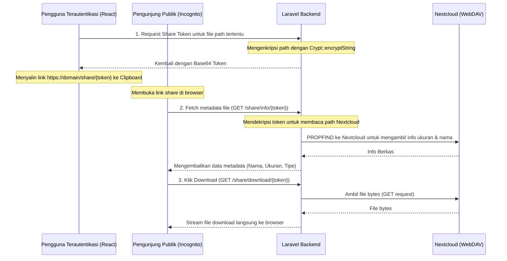

# Panduan Pengembangan SIPTU Drive: Fitur Berbagi Berkas & Editor Dokumen

Dokumen ini berisi rancangan arsitektur, langkah-langkah implementasi, dan draft kode siap pakai untuk pengembangan SIPTU Drive di masa mendatang.

Ada dua fitur utama yang direncanakan:
1. **Fitur Salin & Bagikan Link (Share Link)** untuk mengunduh berkas secara publik tanpa login.
2. **Integrasi Editor Word (.docx) & Excel (.xlsx)** berbasis client-side menggunakan Luckysheet dan Canvas-Editor.

---

## BAGIAN 1: FITUR SALIN & BAGIKAN LINK (SHARE LINK)

Untuk menghindari keharusan melakukan migrasi database di lingkungan hosting production (Hostinger), kita menggunakan metode **Secure Tokens** berbasis enkripsi Laravel (`Crypt::encryptString`) yang disandikan ke Base64.

### 1. Aliran Kerja (Data Flow)



---

### 2. Implementasi Backend (Laravel)

#### A. Rute API (`backend/routes/api.php`)
Daftarkan rute di bawah ini:
```php
// Rute terproteksi (di dalam middleware 'auth:sanctum')
Route::get('/nextcloud/share-token', [\App\Http\Controllers\Api\NextcloudStorageController::class, 'getShareToken']);

// Rute publik (di luar middleware auth, agar bisa diakses tanpa login)
Route::get('/share/info/{token}', [\App\Http\Controllers\Api\NextcloudStorageController::class, 'shareInfo']);
Route::get('/share/download/{token}', [\App\Http\Controllers\Api\NextcloudStorageController::class, 'shareDownload']);
```

#### B. Controller Method (`NextcloudStorageController.php`)
Tambahkan ketiga method ini ke dalam `NextcloudStorageController`:
```php
use Illuminate\Support\Facades\Crypt;

/**
 * Membuat token enkripsi untuk sharing berkas.
 */
public function getShareToken(Request $request)
{
    $request->validate([
        'path' => 'required|string',
    ]);
    
    $path = $request->query('path');
    
    try {
        // Enkripsi path agar aman dan tidak mudah dimanipulasi
        $token = base64_encode(Crypt::encryptString($path));
        return response()->json([
            'token' => $token
        ]);
    } catch (\Exception $e) {
        return response()->json(['message' => 'Gagal membuat tautan berbagi.'], 500);
    }
}

/**
 * Mengambil metadata berkas secara publik berdasarkan share token.
 */
public function shareInfo($token)
{
    try {
        // Dekripsi token kembali ke path berkas Nextcloud asli
        $path = Crypt::decryptString(base64_decode($token));
        
        $url = $this->getWebdavUrl($path);
        $response = $this->httpClient()
            ->withHeaders([
                'X-Requested-With' => 'XMLHttpRequest',
                'Depth' => '0'
            ])
            ->send('PROPFIND', $url);

        if (!$response->successful()) {
            return response()->json(['message' => 'Berkas tidak ditemukan atau telah dihapus.'], 404);
        }

        $xmlStr = $response->body();
        $dom = new \DOMDocument();
        if (@$dom->loadXML($xmlStr)) {
            $xpath = new \DOMXPath($dom);
            $xpath->registerNamespace('d', 'DAV:');
            $responseNodes = $xpath->query('//d:response');
            
            if ($responseNodes->length > 0) {
                $node = $responseNodes->item(0);
                $propstatNodes = $xpath->query('d:propstat/d:prop', $node);
                if ($propstatNodes->length > 0) {
                    $propNode = $propstatNodes->item(0);
                    $displayNameNodes = $xpath->query('d:displayname', $propNode);
                    $getcontentlengthNodes = $xpath->query('d:getcontentlength', $propNode);
                    
                    $name = $displayNameNodes->length > 0 ? $displayNameNodes->item(0)->textContent : basename($path);
                    $size = $getcontentlengthNodes->length > 0 ? (int)$getcontentlengthNodes->item(0)->textContent : 0;

                    return response()->json([
                        'name' => $name,
                        'size' => $size,
                        'path' => $path
                    ]);
                }
            }
        }
        
        return response()->json(['message' => 'Gagal membaca data berkas.'], 500);
    } catch (\Exception $e) {
        return response()->json(['message' => 'Tautan berbagi tidak valid atau telah kedaluwarsa.'], 400);
    }
}

/**
 * Mengunduh berkas secara publik berdasarkan share token.
 */
public function shareDownload($token)
{
    try {
        $path = Crypt::decryptString(base64_decode($token));
        $url = $this->getWebdavUrl($path);
        
        $response = $this->httpClient()
            ->withHeaders(['X-Requested-With' => 'XMLHttpRequest'])
            ->send('GET', $url);

        if (!$response->successful()) {
            return response()->json(['message' => 'Gagal mengunduh berkas.'], 404);
        }

        $contentType = $response->header('Content-Type') ?: 'application/octet-stream';
        $fileName = basename($path);

        return response($response->body(), 200, [
            'Content-Type' => $contentType,
            'Content-Disposition' => 'attachment; filename="' . $fileName . '"',
        ]);
    } catch (\Exception $e) {
        return response()->json(['message' => 'Tautan tidak valid atau telah kedaluwarsa.'], 400);
    }
}
```

---

### 3. Implementasi Frontend (React)

#### A. Pendaftaran Rute Publik (`App.jsx`)
Daftarkan rute `/share/:token` agar dapat diakses tanpa login:
```jsx
import PublicSharePage from "./views/PublicSharePage.jsx";

// Di dalam <Routes>
<Route path="/share/:token" element={<PublicSharePage />} />
```

#### B. Aksi Menyalin Tautan (`PenyimpananCloud.jsx`)
Tambahkan logika handler salin tautan berikut:
```javascript
const handleShareLink = async (file) => {
  try {
    const response = await apiFetch(`/nextcloud/share-token?path=${encodeURIComponent(file.path)}`);
    if (!response.ok) throw new Error("Gagal generate link berbagi.");
    
    const data = await response.json();
    const shareUrl = `${window.location.origin}/share/${encodeURIComponent(data.token)}`;
    
    // Salin ke Clipboard
    await navigator.clipboard.writeText(shareUrl);
    andMessage.success("Link berbagi berhasil disalin ke clipboard!");
  } catch (err) {
    andMessage.error(err.message);
  }
};
```
*Gunakan fungsi ini di dropdown aksi grid card maupun baris tabel list-view.*

#### C. Halaman Landing Publik (`PublicSharePage.jsx`)
Halaman minimalis dan responsif untuk mengunduh file yang dibagikan secara publik:
```jsx
import { useEffect, useState } from "react";
import { useParams } from "react-router-dom";
import { Button, Card, Typography, Spin, Empty } from "antd";
import { DownloadOutlined, FileFilled, CloudServerOutlined } from "@ant-design/icons";
import "./PublicSharePage.css";

const { Title, Text } = Typography;

export default function PublicSharePage() {
  const { token } = useParams();
  const [fileInfo, setFileInfo] = useState(null);
  const [loading, setLoading] = useState(true);
  const [error, setError] = useState("");

  const baseUrlRaw = import.meta.env.VITE_API_URL || "https://siptu.bpompalopo.com/core_api/api";
  const baseUrl = baseUrlRaw.replace(/\/+$/, "");

  useEffect(() => {
    const fetchInfo = async () => {
      try {
        const response = await fetch(`${baseUrl}/share/info/${token}`);
        if (!response.ok) {
          const data = await response.json();
          throw new Error(data.message || "Tautan tidak valid.");
        }
        const data = await response.json();
        setFileInfo(data);
      } catch (err) {
        setError(err.message);
      } finally {
        setLoading(false);
      }
    };
    fetchInfo();
  }, [token, baseUrl]);

  if (loading) {
    return (
      <div className="share-landing-loader">
        <Spin size="large" tip="Membaca berkas..." />
      </div>
    );
  }

  if (error) {
    return (
      <div className="share-landing-error">
        <Empty description={error} />
      </div>
    );
  }

  return (
    <div className="share-landing-layout">
      <div className="share-brand-header">
        <CloudServerOutlined />
        <span>SIPTU Drive</span>
      </div>
      
      <Card className="share-landing-card" hoverable>
        <div className="share-file-visual">
          <FileFilled className="share-large-icon" />
        </div>
        <Title level={4} className="share-file-name" ellipsis>
          {fileInfo?.name}
        </Title>
        <Text type="secondary" className="share-file-size">
          Ukuran: {parseFloat((fileInfo?.size / (1024 * 1024)).toFixed(2))} MB
        </Text>
        
        <Button
          type="primary"
          size="large"
          icon={<DownloadOutlined />}
          href={`${baseUrl}/share/download/${token}`}
          className="share-download-btn"
          block
        >
          Unduh Berkas
        </Button>
      </Card>
    </div>
  );
}
```

---
---

## BAGIAN 2: INTEGRASI PENYUNTING DOKUMEN (LUCKYSHEET & CANVAS-EDITOR)

Integrasi editor spreadsheet dan pengolah kata langsung di web (tanpa server office server-side yang berat).

### 1. Luckysheet (Penyunting `.xlsx`)

#### A. Dependensi Frontend
Masukkan pustaka CDN ini pada file `index.html` frontend:
```html
<link rel='stylesheet' href='https://cdn.jsdelivr.net/npm/luckysheet/dist/css/luckysheet.css' />
<link rel='stylesheet' href='https://cdn.jsdelivr.net/npm/luckysheet/dist/assets/iconfont/iconfont.css' />
<script src="https://cdn.jsdelivr.net/npm/luckysheet/dist/luckysheet.umd.js"></script>
<!-- Luckyexcel untuk impor xlsx -->
<script src="https://cdn.jsdelivr.net/npm/luckyexcel/dist/luckyexcel.umd.js"></script>
```

#### B. Mekanisme Impor Berkas
1. Ambil berkas `.xlsx` sebagai Blob dari backend.
2. Gunakan `LuckyExcel` untuk mengubah berkas menjadi objek JSON.
3. Muat objek JSON ke kontainer Luckysheet:
   ```javascript
   LuckyExcel.transformExcelToLucky(fileBlob, (exportJson) => {
       luckysheet.create({
           container: 'luckysheet-canvas-container',
           data: exportJson.sheets,
           title: fileInfo.name
       });
   });
   ```

#### C. Mekanisme Ekspor & Auto-Save
1. Ambil data JSON cell dari Luckysheet: `luckysheet.getluckysheetfile()`.
2. Gunakan library `exceljs` di React untuk mengubah JSON cell kembali menjadi Blob biner Excel.
3. Kirim file biner tersebut ke backend menggunakan HTTP Request (`PUT` / `POST`) ke Nextcloud.

---

### 2. Canvas-Editor (Penyunting `.docx`)

#### A. Dependensi Frontend
Instal modul editor:
```bash
npm install @hufe921/canvas-editor
```

#### B. Mekanisme Kerja
1. Download berkas `.docx` sebagai blob.
2. Lakukan konversi biner `.docx` menjadi payload JSON paragraf terstruktur (bisa dilakukan menggunakan library `PHPWord` di backend untuk parsing dokumen, lalu dikirim dalam bentuk JSON rapi ke frontend).
3. Inisialisasi Canvas-Editor di React:
   ```javascript
   import Editor from '@hufe921/canvas-editor';
   
   const container = document.getElementById('word-editor-container');
   const editor = new Editor(container, {
     main: parsedParagraphsJsonData
   });
   ```
4. Simpan kembali dengan memanggil `editor.command.getValue()` untuk mengekspor data teks/gaya dan menulisnya kembali ke format `.docx` melalui backend.
